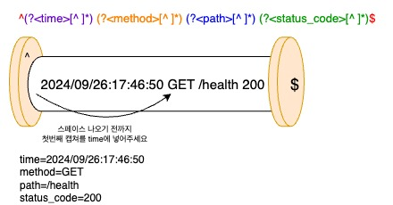

# 로깅을 위한 간단 정규표현식

정규표현식(Regular Expression; Regex)는 언뜻 보기에 매우 복잡해 보이지만 사실 의미를 알고나면 매우 쉽습니다.

```
원본로그: Hello Daeyang High
정규표현: ^(?<data1>[^ ]*) ^(?<data2>[^ ]*) ^(?<data3>[^ ]*)$
캡쳐결과: data1=Hello, data2=Daeyang, data3=High
```
위 예시는 간단하게 스페이스로 띄워진 3개의 값(```Hello```, ```Daeyang```, ```High```)을 받아온 것입니다. 어떻게 가능한건지 글자 하나하나 마다 살펴봅시다!

# 1. ```^``` 와 ```$```

```
^ ... $
```
정규표현식 맨 앞에 있는 ```^``` 는 시작을 의미하고 맨 뒤에 있는 ```$```는 끝을 의미합니다. 로깅할때 의미는 "데이터가 꼭 n개여야 하는가? 아니면 더 있어도 되는가"로 보면 됩니다.

쉽게 뚜껑이라 생각하면 됩니다.


여기서는 ```^``` 와 ```$``` 가 둘다 있으므로 ```data1```, ```data2```, ```data3``` 문자열만 있어야 된다는 의미가 됩니다. 예시 2번 처럼 만약 3개가 아니라 더 많이 있다면 로거는 잘못된 로그로 판단하고 그 로그를 무시합니다.

만약 앞에 3개만 가져오고 나머지는 무시하게 하고 싶다면 끝문자인 ```$``` 를 없에면 됩니다.


```$``` 끝문자를 지우면 값이 더 많더라도 잘 가져오는것을 알 수 있다. ```^``` 는 로깅을 하는 중에는 거의 건들 일이 없다고 보면 됩니다.

# 2. ```(```, ```(?``` 와 ```)```
정규표현식에서 ```(``` ```)``` 는 프로그래밍 언어처럼 아무 의미가 없는게 아니라 값을 캡쳐(긁어오기)를 할때 쓰는 특수문자입니다.


이해를 위해 먼저 ```?``` 가 달린 ```(?``` 문법부터 알아봅시다!
캡쳐마다 앞에서 부터 1번 2번 3번으로 번호가 정해져있고 각각에 담으라는 말입니다.

만약 ```?``` 기호가 없다면 어떻게 될까요?


```?``` 기호는 조건에 맞는 딱 하나를 캡쳐하라는 문법인데, 이것이 없으면 조건에 맞으면 전부 캡펴하라는 문법이 되어 1번 캡쳐가 모든것을 다 먹어버릴 것이다.

일반적인 로그 환경에선 ```(?``` 를 사용해야 한다.

# 3. ```<이름>```
```<이름>``` 문법은 생각한대로 각 캡쳐에 이름을 달아주는 역할을 합니다.


# 4. ```[^ ]*```
```[^문자]*``` 문법은 캡쳐할때 어디까지 캡쳐할 것인가로 생각하면 됩니다.
이때까지 ```[^ ]*``` 로 하였는데 이 뜻은 "스페이스가 아닌것만 캡쳐해 주세요" 이며 쫌더 풀어 쓰면 "스페이스가 나올때까지만 캡쳐할게요"라는 의미입니다.


이처럼 ```[^"]*``` 로 ```"``` 가 로그에 나올때까지 읽게 할 수 있습니다.

# 5. 응용
위 문법들을 응용해서 다음 로그를 파싱해봅시다!

#### 띄워쓰기로 구분된 간단한 로그
```
원본로그: 2024/09/26:17:46:50 GET /health 200
정규표현: ^(?<time>[^ ]*) (?<method>[^ ]*) (?<path>[^ ]*) (?<status_code>[^ ]*)$
캡쳐결과: time=2024/09/26:17:46:50, method=GET, path=/health, status_code=200
```



#### 콤마로 구분된 간단한 로그
```
원본로그: 2024/09/26:17:50:00 GET /healthcheck 502
정규표현: ^(?<time>[^ ]*),(?<method>[^ ]*),(?<path>[^ ]*),(?<status_code>[^ ]*)$
켭쳐결과: time=2024/09/26:17:50:00, method=GET, path=/healthcheck, status_code=502
```


# 6. 실제 어플리케이션 로그 파싱
```
원본로그:
::1 - (2024-09-26T17:54:56Z) "GET / HTTP/1.1 404 0.0 "curl/8.2.1""

정규표현식:
^(?<remote_addr>[^ ]*) [^ ]* \((?<time>[^\]*)\) "(?<method>[^ ]*) (?<path>[^ ]*) (?<protocol>[^ ]*) (?<status_code>[^ ]*) [^ ]* "(?<user_agent>[^"]*)""$

캡쳐결과:
remote_addr=::1
time=2024-09-26T17:54:56Z
method=GET
path=/
protocol=HTTP/1.1
status_code=404
user_agent=curl/8.2.1
```